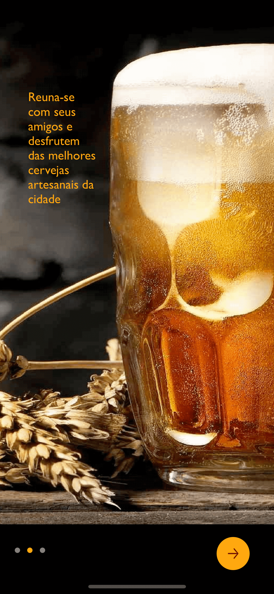
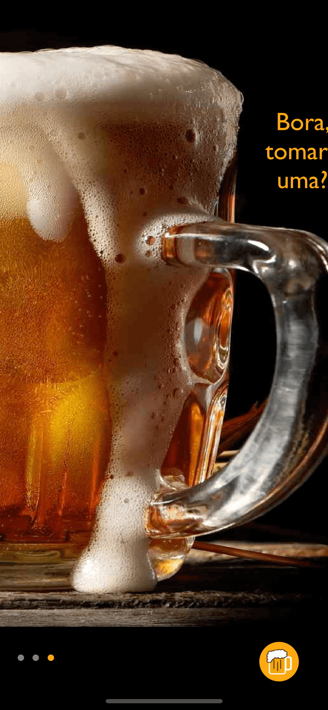
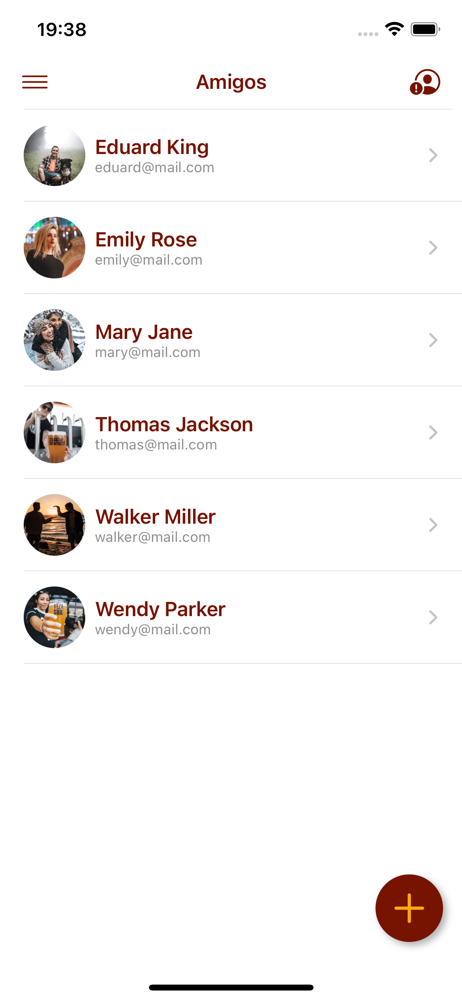
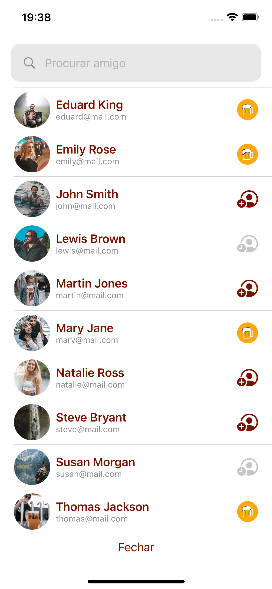
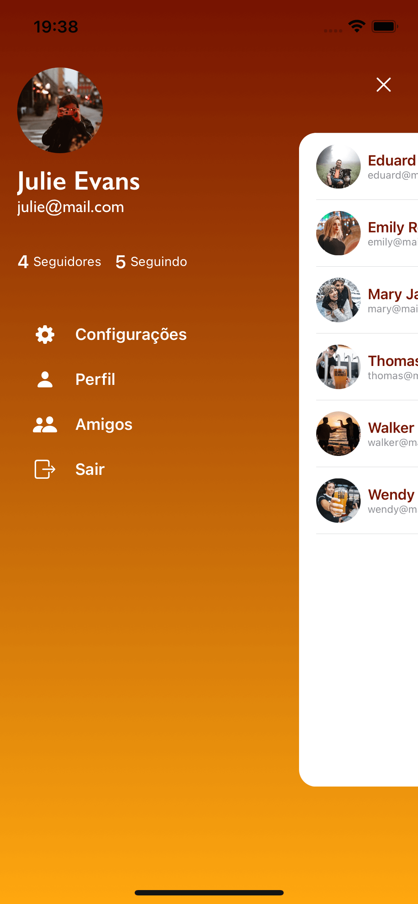
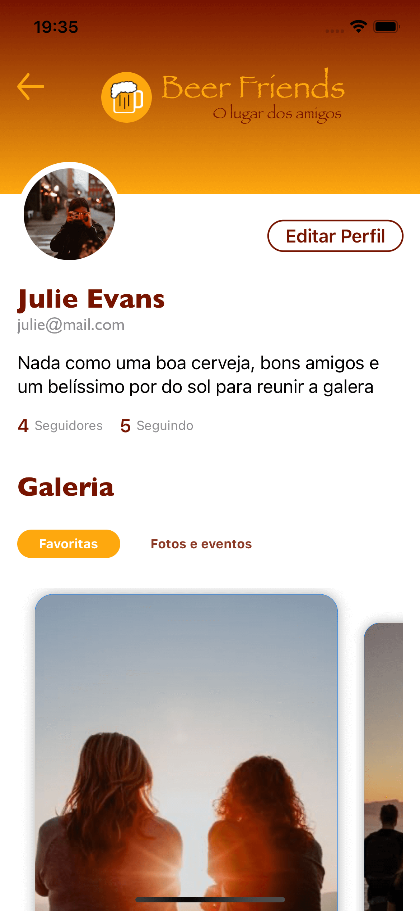
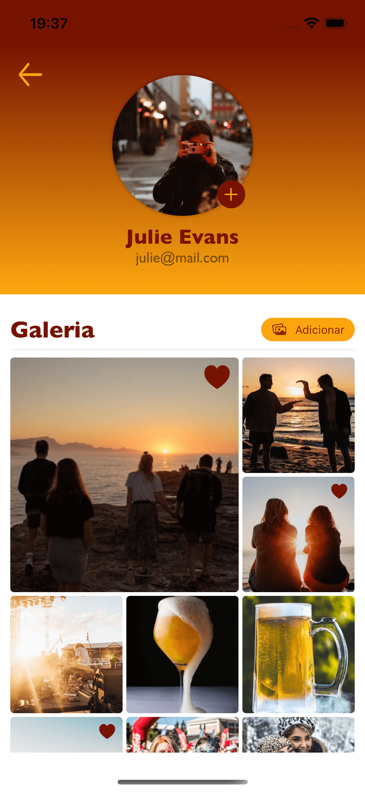
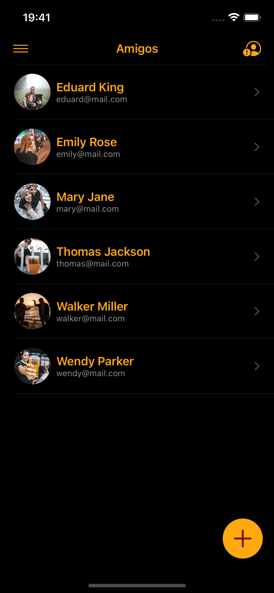
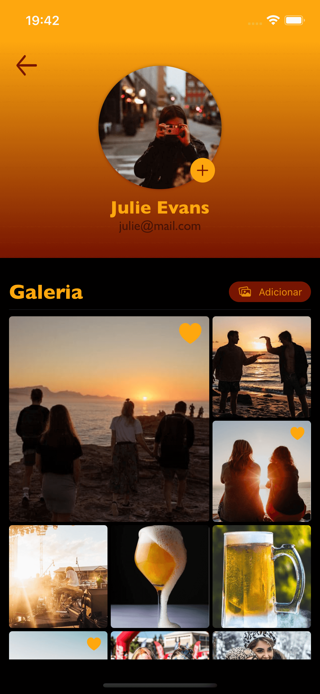

# Sejam bem-vindos!

Buscando e projetando novas ideias.

## Projetos

###Beer Friends - O lugar dos amigos

Projeto destinado aos amigos da cerveja onde os usuários poderão compatilhar perfis, fotos, realizar novas amizades, divulgar eventos na cidade e muito mais.

   <video src="https://wamarra.github.io/videos/beer-friends.mov" data-canonical-src="https://wamarra.github.io/videos/beer-friends.mov" controls="controls" muted="muted" class="d-block rounded-bottom-2 width-fit" style="max-height:640px; border-radius: 50px">
  </video>

## Política de privacidade e Termos de uso
- [Política de privacidade](https://wamarra.github.io/privacyPolicy.html)
- [Termos de uso](https://wamarra.github.io/termsOfUse.html)

## Suporte

Encontrou algum problema no aplicativo? Por favor, registre no endereço de [suporte](https://github.com/wamarra/BeerFriends/issues) que ajudaremos você a resolver.

## Contato

<strong>Nome:</strong> Wesley Marra  
<strong>E-mail:</strong> <wamarra@gmail.com>
